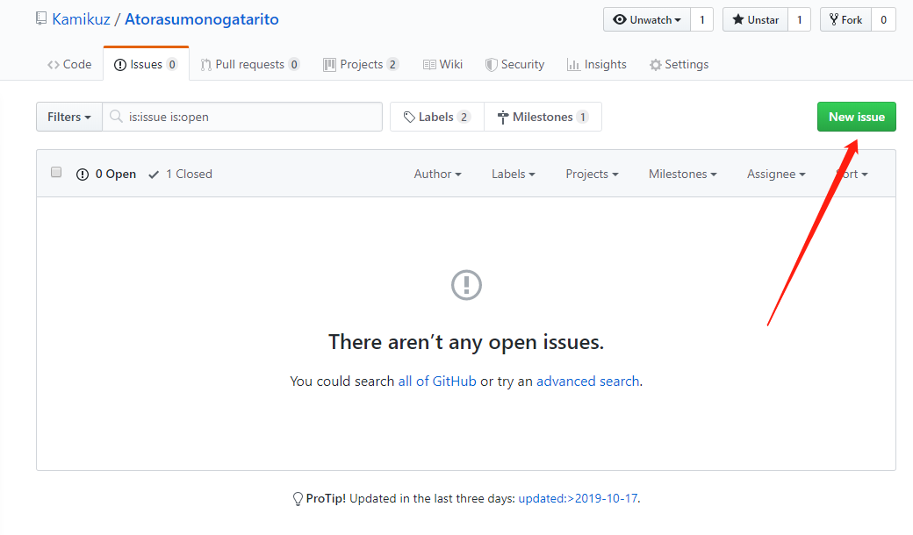
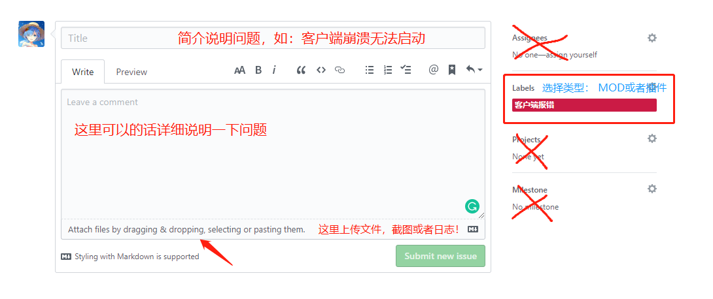
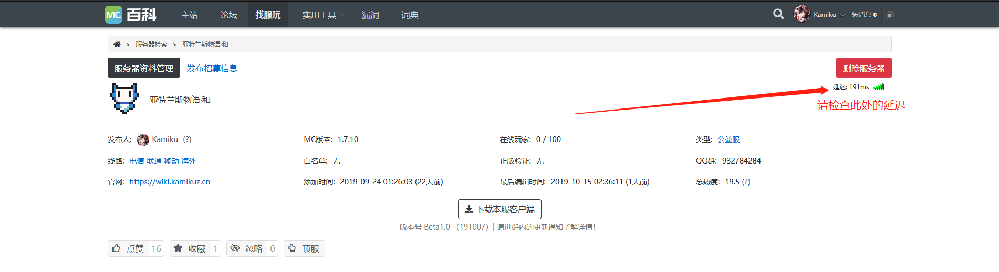

# 常见问题与解答 :id=faq

## 服务器的游戏规则 :id=rules

我们制定了[亚特兰守则规则](welcome/rules.md)。

## 怎么联系管理组 :id=how-to-contact

- 游戏内部：
  - 按住<kbd>方向键↑</kbd>进入快捷菜单，点击`op救助`

- 群内：
  - @群管理即可，或者私信

## 客户端出问题了&服务器出现问题了？:id=issue

我们采用Github平台的[issues（问题反馈模块）](https://github.com/Kamikuz/Atorasumonogatarito/issues)来提供问题反馈，以下是流程：

?>您可以参考这个例子来反馈[例子](https://github.com/Kamikuz/Atorasumonogatarito/issues/2)

1. 截图或者保留错误日志
2. 进入[issues（问题反馈模块）](https://github.com/Kamikuz/Atorasumonogatarito/issues)点击`New issue`开始发布。
  - 
3. 按照下面例图或者上面的[例子](https://github.com/Kamikuz/Atorasumonogatarito/issues/2)填写信息并附加图片或者日志。完成！
  - 

## 服务器的更新策略 :id=update-policy

!>由于目前服务器处于`Beta`测阶段，更新时间为每两周更新一次，请随时注意客户端内的通知以及群里面的公告！

## 服务器的换图策略 :id=save-policy

目前主世界图将作为永久图以供玩家建设，如遇到特殊情况（崩服，恶意建筑毁坏，恶意高频红石）将进行退档处理。

## 给那些刚刚进入游戏的玩家指南 :id=new-join

### 〇这是什么小窗口？

每次启动，你会发现有这个小窗口出现，这是由于亚特兰斯采用了[RTM](mods/rtm.md)模组，而这个模组在加载时需要自带的加载器来加载mods文件里面的追加包，因此加载时间比较长。

!>请务必在此加载器加载完后在进入服务器，否则会出现客户端崩溃！

### ①服务器登录不进去？服务器离线？

- 如果你是第一次玩我们的客户端的话请点击右边的`注册`按钮进行注册！请勿使用Mojang的账号进行登录。亚特兰斯物语服务器采用自己的API验证系统，需要在[亚特兰斯物语皮肤站](https://mc.kamikuz.cn)进行账号注册！新来的请认真阅读[客户端入门](welcom/client.md)!

- 如果进入客户端后发现服务器登录不进去，一直卡死在登录中..又或者直接显示离线。请按照一下步骤排查：

>访问[亚特兰斯物语下载页](https://wiki.kamikuz.cn/download.html)查看`服务器案内`的维护通告！
>如果没有维护的话请检查自己的网络状况并访问[MC百科官方宣传站](https://play.mcmod.cn/sv20182663.html)检查页面右上方的延迟（国内用户一般延迟在100ms以上，这是由于服务器在美国，中间由frp进行网络中转导致出现大量的延迟，以后准备在国内使用云主机来解决问题）：

>最后上面显示离线状态时，请立即通知群内的管理员来进行服务器的维护工作！

